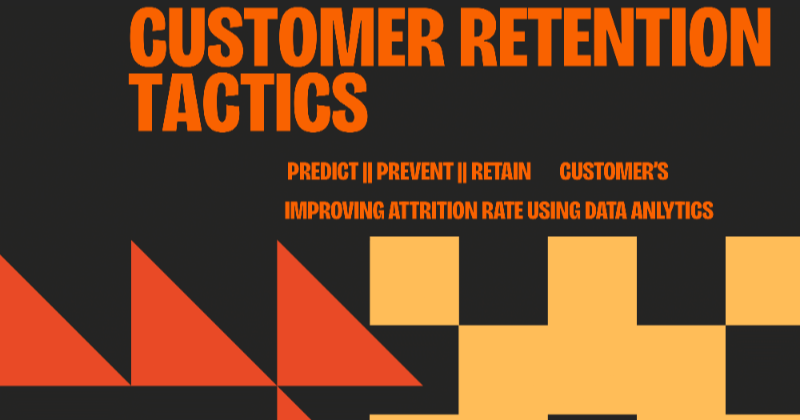
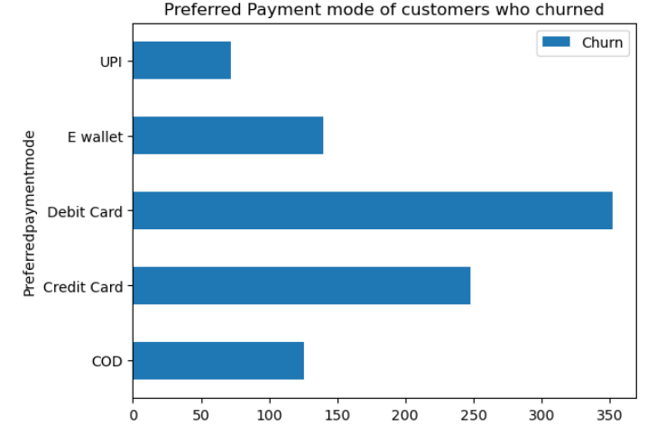
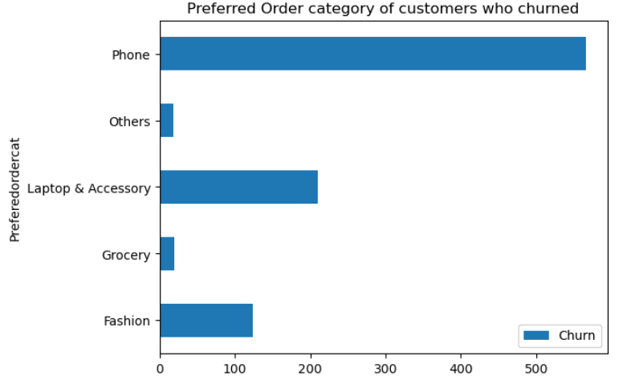
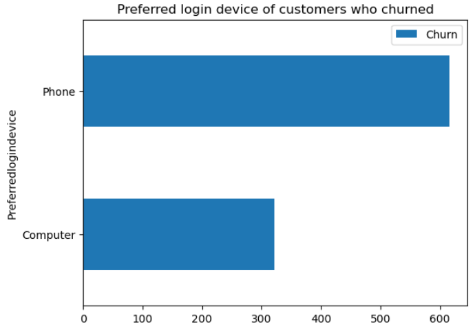
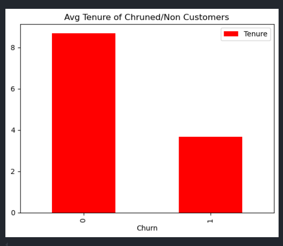
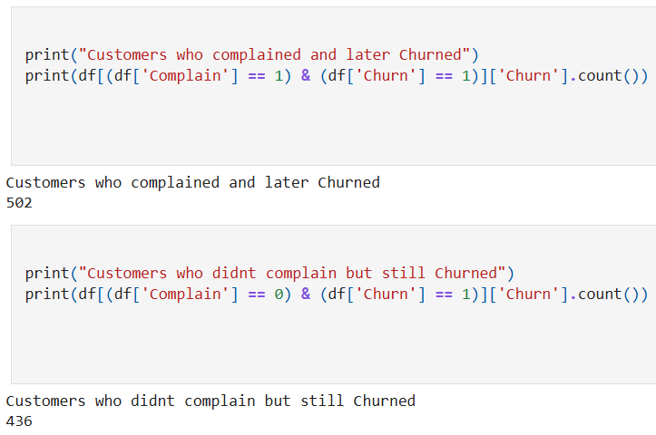
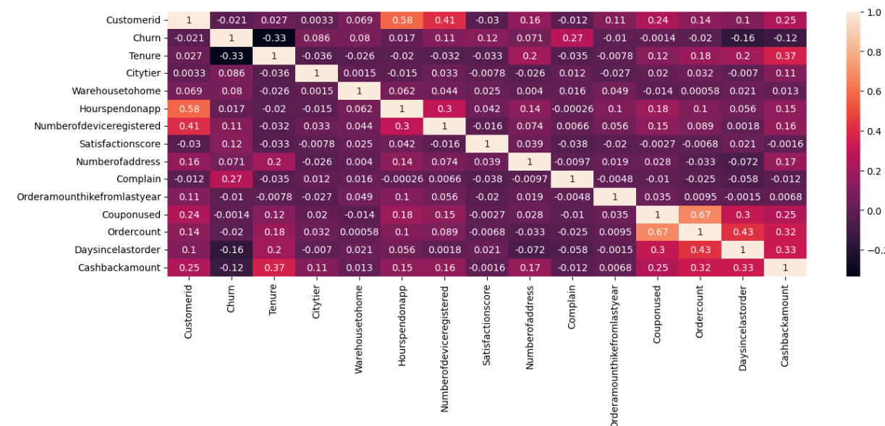

# 🛒 E-Commerce Customer Churn Forecast and Analysis

## 🔍 Business Problem

Understanding the key factors affecting customer churn is crucial in e-commerce or any other industry. It helps reduce losses and maximize profits for the service or company. Using data, we can improve retention strategies to prevent customer loss. This project analyzes customer behavior using various charts, visuals, and techniques to understand the behavior of churned customers and prevent future churn using machine learning.

## 📊 Key Insights Supporting Business Growth:

### 1. Preffered Payment Mode of Chruning Customers:

### 2. Preffered Order category of Churning Customer:  

### 3. Login Device of Chruned Customers:  

### 4. Avg Tenure years of churned and non churned customers:

### 5. Chruning Rate of Customers with and Without Complaints:

### 6. Co-Relations of features affecting Churn:  

---

## ⚙️ Tech Stack

- **Python** (3.10+)
- **Pandas**, **NumPy**
- **Seaborn**, **Matplotlib**
- **XGBoost**, **Scikit-learn**
---
## 🔬 Methods

### 🔹 Outlier Handling
- Used **Box Plots** to detect and handle statistical outliers in numeric features.

### 🔹 Customer Behaviour Analysis
- Conducted **univariate and bivariate analysis**.
- Aggregated data by churn label to detect behavior patterns.

### 🔹 Feature Engineering & Correlation
- Detected multicollinearity using **Variance Inflation Factor (VIF)**.
- Performed **target encoding** for categorical features.

### 🔹 Model Training & Evaluation
- Built reusable functions to train and evaluate models.
- Trained models: **Logistic Regression**, **Random Forest**, **XGBoost**.
- Best model: **XGBoost Classifier** with:
  - **Accuracy:** 0.94
  - **AUC Score:** 0.97
  - **Recall optimized for churned class**

### 🔹 Threshold Tuning & Metric Optimization
- Lowered probability threshold to increase recall.
- Visualized results with **ROC**, **confusion matrix**, and **precision-recall curves**.

---

## 📌 License

This project is licensed under the [MIT License](LICENSE).
---

### 👤 Author
Developed and Documented by Adin Raja **Adin Raja** – [LinkedIn](https://www.linkedin.com/in/adinraja78/), [Gmail](mailto::adinraja78@gmail.com)
---